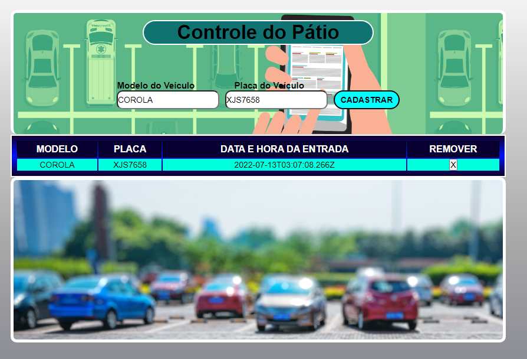

# Parking Control - developed with Typescript

<h4>This repository is the delivery of the Typescript project challenge Digital Innovation One<h4>

## Features

- Vehicle entry registration in the yard by model and license plate
- View of vehicles inside the yard
- Departure from the vehicle with information on the time spent inside the yard
  
## Available Scripts

In the project directory, you can run:  npx -p typescript tsc to transpile the code!

